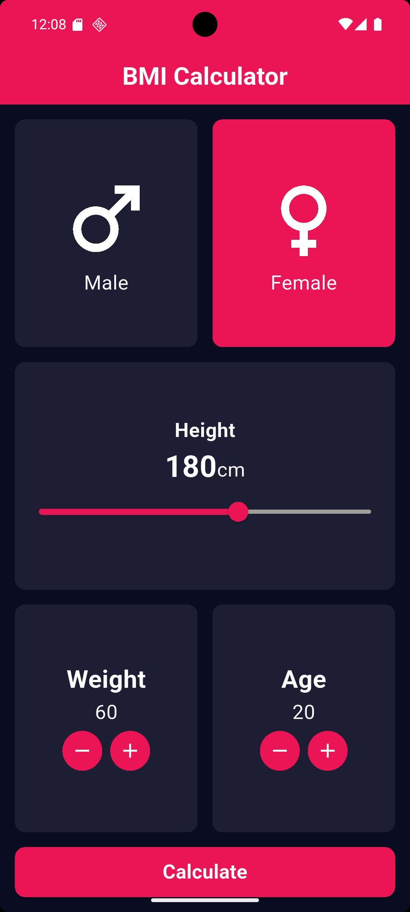
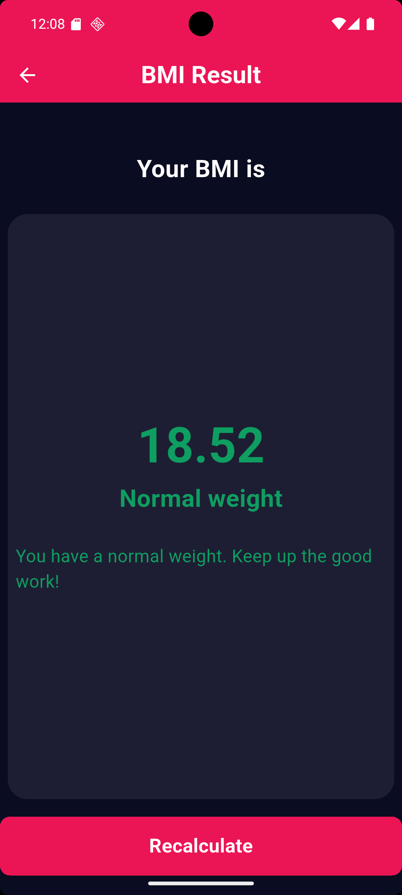
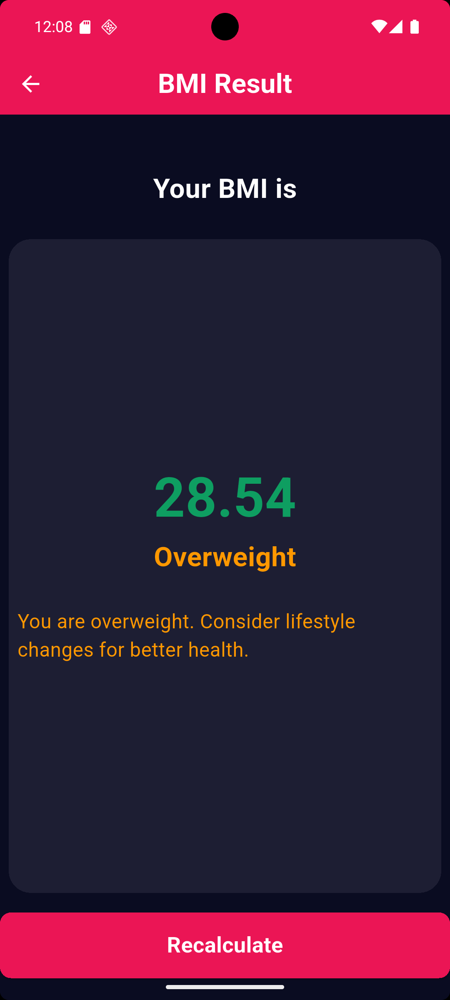
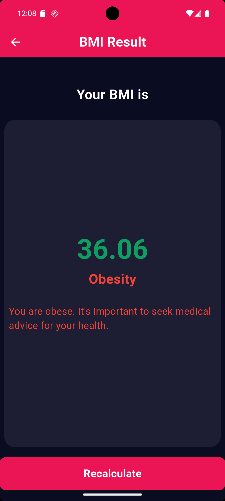

# 🧮 BMI Calculator

A simple and elegant **BMI (Body Mass Index) Calculator App** built with **Flutter**.  
The app helps users calculate their BMI by entering their gender, height, weight, and age, then provides a categorized result with useful health advice.

---


## 📱 Screenshots

<p align="center">
  
  
</p>

<p align="center">
  
  
</p>

<p align="center">
  
</p>


---

## 🚀 Features

- 🚻 Gender selection (Male / Female)  
- 📏 Adjustable height with a slider  
- ⚖️ Adjustable weight and age with +/- buttons  
- 🔢 Instant BMI calculation  
- 💡 Clear health classification with advice  
- 🎨 Modern and responsive Flutter UI  

---

## 📐 BMI Categories

| BMI Range        | Category       |
|------------------|----------------|
| < 18.5           | Underweight    |
| 18.5 - 24.9      | Normal Weight  |
| 25.0 - 29.9      | Overweight     |
| 30.0 and above   | Obese          |

---

## 🛠️ Built With

- [Flutter](https://flutter.dev/)  
- Dart  

---

## 📦 Installation

1. Clone the repository:

   ```bash
   git clone https://github.com/your-username/bmi-calculator-flutter.git
